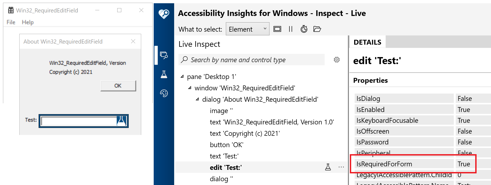

# Win32_RequiredEditField
A Win32 app based on the Visual Studio template, which demonstrates how to mark an edit field programmatically as being required. This means a screen reader will announce "required" when it encounters the field.

A while back I wrote [Text_LiveSetting](https://docs.microsoft.com/en-us/accessibility-tools-docs/items/Win32/Text_LiveSetting), which contains code snippets showing how to customize the UIA representation of Win32 controls for one specific purpose. I took that example and modified it to set a different UIA property on a control. I created this demo Win32 app from the VS template, added an edit field to the Help dlg, and then set the UIA IsRequiredForForm property on that field. With that change, Narrator announces "Required" when encountering the field. I've made the code public here, and put "Barker" near all the code of interest. 

The screenshot below shows the Accessibilty Insights for Windows tool reporting that the UIA IsRequiredForForm property on the edit field is true.

# UPDATE

I recently had reason to explore setting an accessible value on a custom Win32 control, so I've updated the sample app to demonstrate that. In this demo, a custom value is set on the Button in the About dialog. Typically there'd be no reason to take this action with a Button (unless perhaps the Button presented some custom visuals conveying additional important information), but the same steps would work with a custom control.

The identifier for the property being set is Value_Value_Property_GUID, and that's the Value property from the UI Automation (UIA) Value pattern. The demo does not change the default read-only property from the Value pattern.

The screenshot below shows the Accessibilty Insights for Windows tool reporting that the control supports the UIA Value pattern, and its Value property is the demo string: "This is a demo value."

